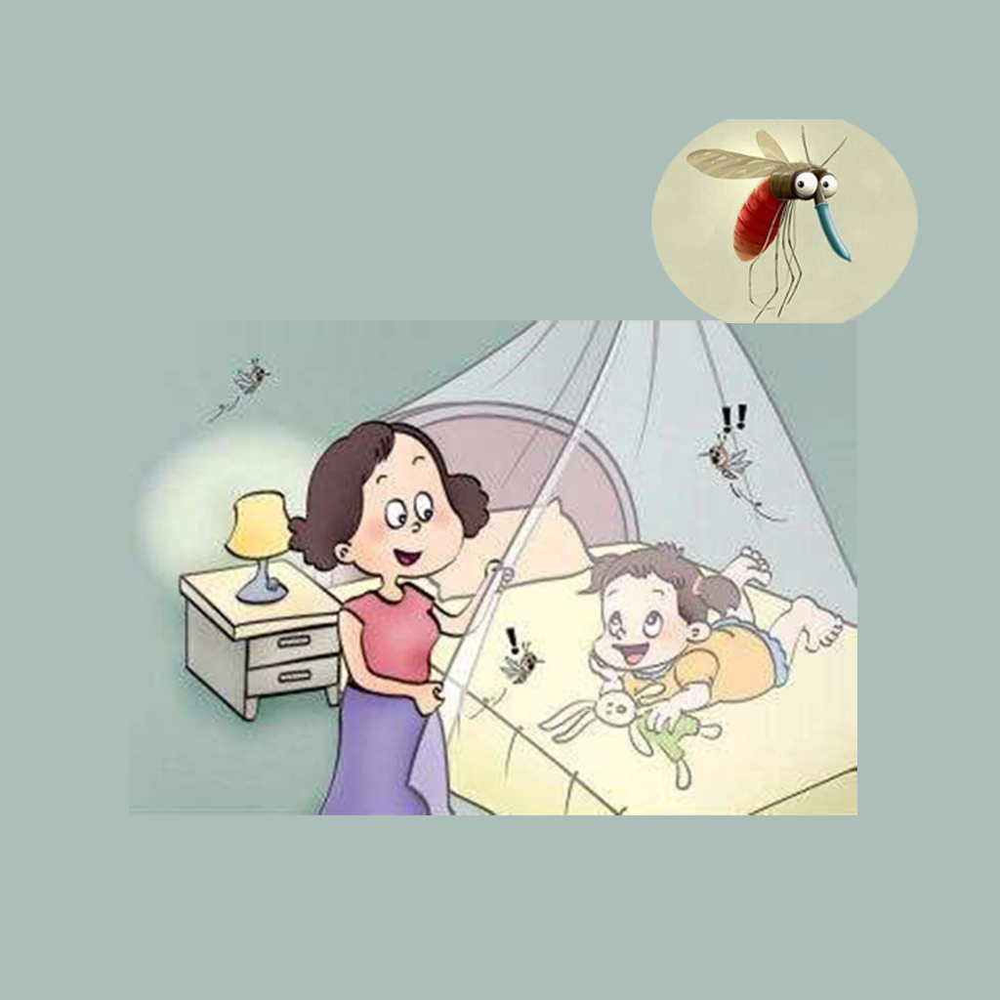

## Welcome to My Catch Mosquitoes Record 

Have you ever been woken up by a mosquito bite or a mosquito buzz while you were sleeping? When you wake up very unhappy, the good mood of the day is affected. To avoid this problem, turn your worries into fun by catching a mosquito every night before you go to bed and driving it out. You can keep track of how many mosquitoes you catch each day, when, where, and the mood of each experience. Compile a list of your experiences to help you get a good night's sleep without mosquitoes.

If you have any questions, you can either leave a message or send the questions to our email address.

We will answer them for you in the first time.

### Address: sun778297ma@163.com

Thank you!
